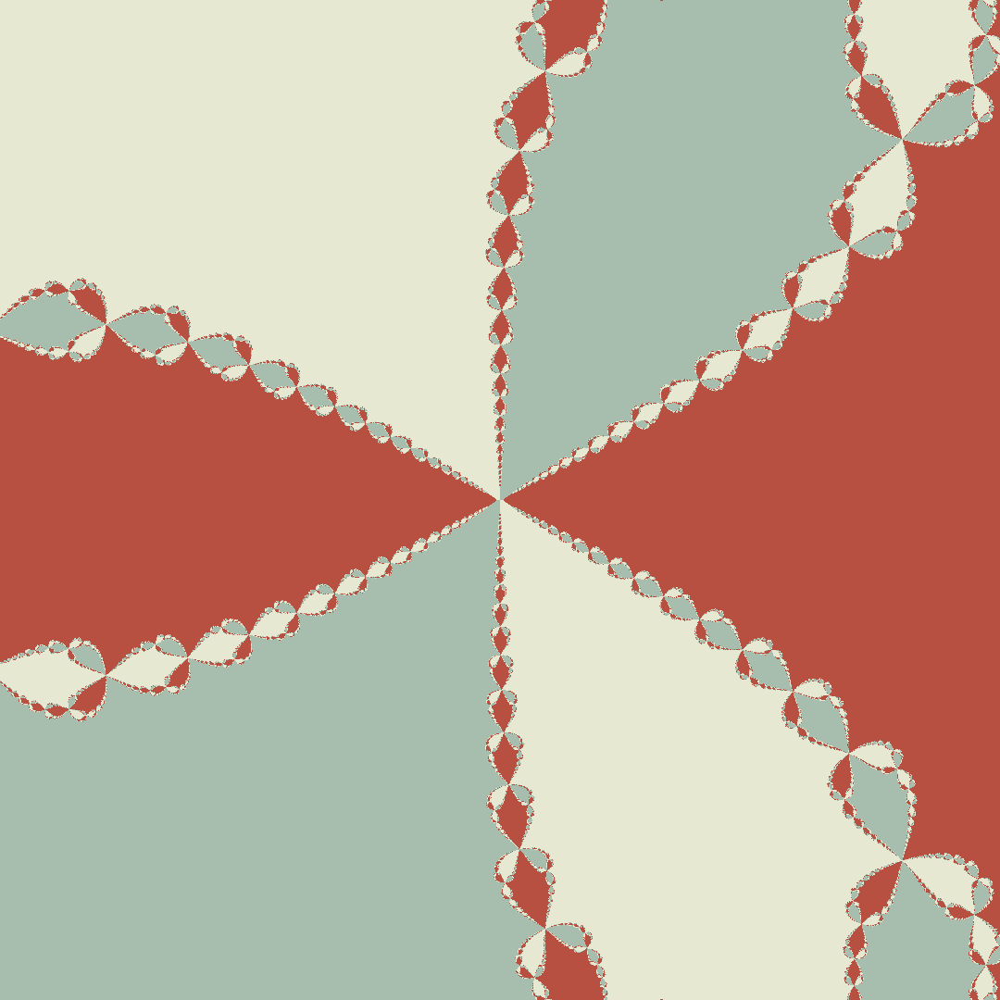

# Newton Fractals

<div align="center" border-radius="20px">
    
</div>

*You can watch the sample video [here](https://www.youtube.com/watch?v=voszkR4Pq9c).*

## Introduction
First of all, I really like mathematics, and the first time I saw a fractal, I thought it was looking faboulous, but I never got the chance to actually dive into how to implement it (I thought you needed to be an expert in mathematics). However, after watching [3Blue1Brown](https://www.3blue1brown.com/)'s video on [Beyond the Mandelbrot set, an intro to holomorphic dynamics](https://www.youtube.com/watch?v=LqbZpur38nw), I thought I would look into that. So, here it is!

## Download
So, you want to try it out? I am so happy to hear that! Just open your terminal and run to clone the repository:
```bash
git clone https://github.com/yunusey/NewtonFractals
```
Now, you can import the project to Godot and play with it yourself.

## Web version?
You can try out it on [web](https://yunusey.itch.io/newton-fractals). The quality won't be as good, but it is convenient as you can test it without cloning.

## How to use
Once you run the program, you will see a basic number line that will help you to put where exactly you want to put the roots into. To add a root, navigate your mouse to where you want to add the root then press `right-mouse-button`. To change the position of the roots, you can drag the roots using `left-mouse-button`. To change the colors of the roots, press `A` while hovering over the root. To delete a root, press `X` while hovering over it. Use your `scroll-wheel` to increase/decrease number of iterations (the precision of the animation)--both low precision and high precision have their own beautiful features so make sure to do that. To start the simulation, simply press `Enter`. You still can change the number of iterations when you start the animation, but you cannot add any roots or change colors. To take a screenshot, you can use `S` and it will save the screenshot into `user://newton-fractal-screenshot.png`. You can learn more about the [file paths in Godot here](https://docs.godotengine.org/en/stable/tutorials/io/data_paths.html).

## Notes on Calculations
PS: There is a problem with MathJAX's rendering of $\sum$ when they are used in fractions. This is why this expression $\frac{1}{\sum_{k = 0}^{n}}$ and the ones you will see below look weird.

Calculating the Newton fractals can be hard in Godot shaders. The main reason is that floats are not very accurate and can overflow easily. Let's take a look at how theory and reality differed (again...):

So, we want to calculate our step each iteration. How do we calculate a step for each iteration? It is so easy:

$$
z_{n + 1} = z_n - \frac{f(z)}{f'(z)}
$$

where $z$ is our current value (or the given value if we are in the first iteration), $f(z)$ is the function we want to calculate, $f'(z)$ is the derivative of the function. 

The plan I had was that the user was going to give me the roots, so that my $f(z)$ would be equal to:

$$
f(z) = (z - z_0)(z - z_1)(z - z_2) \ldots (z - z_n)
$$

where $z_0, z_1, z_2, \ldots, z_n$ are the roots; and I was going to find a way to calculate $f(z)$ and $f'(z)$. So, I started thinking about how, until I realized the following formula:

Let's use chain rule to find the derivative:

$$
f'(z) = \frac{d}{dz} (z - z_0)(z - z_1)(z - z_2) \ldots (z - z_n) 
$$

$$
f'(z) = (z - z_1)(z - z_2) \ldots (z - z_n) + (z - z_0)\frac{d}{dz} (z - z_1)(z - z_2) \ldots (z - z_n)
$$

Here, I realized something great! We are just adding up $\frac{f(z)}{z - z_n}$ for each $n$. So, I ended up with:

$$
f'(z) = \sum_{k = 0}^{n} \frac{f(z)}{z - z_n}
$$

It's soo easy to implement, right? Well, not really. I wrote this program to calculate the derivative:
```glsl
vec2 derivative = vec2(0.0, 0.0);
vec2 eval = evaluate(num); // just f(z)
for (int i = 0; i < num_roots; i++) {
    vec2 term = divide(eval, num - roots[i]); // divide is a function that calculates complex division.
    derivative += term;
}
```

The problem with this implementation is that division causes the result to be inaccurate. In theory, there is no problem with this implementation--of course there is also a huge chance that I messed up on my calculations :D--(if we had computers with infinite float sizes, probably we would see that the result is just fine!), but the result is just **disappointing**. And just in case you would like to see what other simplifications we can make to the formula we just found, check this out: since we don't actually care about $f(z)$ or $f'(z)$, we can just focus on calculating the ratio ($\frac{f(z)}{f'(z)}$):

$$
\frac{f(z)}{f'(z)} = \frac{f(z)}{\sum_{k = 0}^{n} \frac{f(z)}{z - z_n}}
$$

$$
\frac{f(z)}{f'(z)} = \frac{f(z)}{f(z) \cdot \sum_{k = 0}^{n} \frac{1}{z - z_n}} = \frac{1}{\sum_{k = 0}^{n} \frac{1}{z - z_n}}
$$

Even though this simplification is so exciting, we, again, need to divide $1$ by $z - z_n$ for each $n$. So, the problem with accuracy in division will occur one more time.

What now? Well, we will go back to less efficient but working method of calculating the derivative:

$$
f'(z) = (z - z_1)(z - z_2) \ldots (z - z_n) + (z - z_0)(z - z_2) \ldots (z - z_n) + \ldots
$$

Let's look at its implementation:
```glsl
vec2 derivative = vec2(0.0, 0.0);
for (int i = 0; i < num_roots; i++) {
    vec2 term = vec2(1.0, 0.0);
    for (int j = 0; j < num_roots; j++) {
        if (i != j) {
            term = multiply(term, num - roots[j]); // multiply is a function that calculates complex multiplication.
        }
    }
    derivative += term;
}
```
Eureka! We found a soulution that actually works even though we made the program's [Big O](https://en.wikipedia.org/wiki/Big_O_notation) jump from $O(n)$ to $O(n^2)$ (where $n$ is the number of roots), but it is fine--we restrict the number of roots to be less than $10$ in our program).
